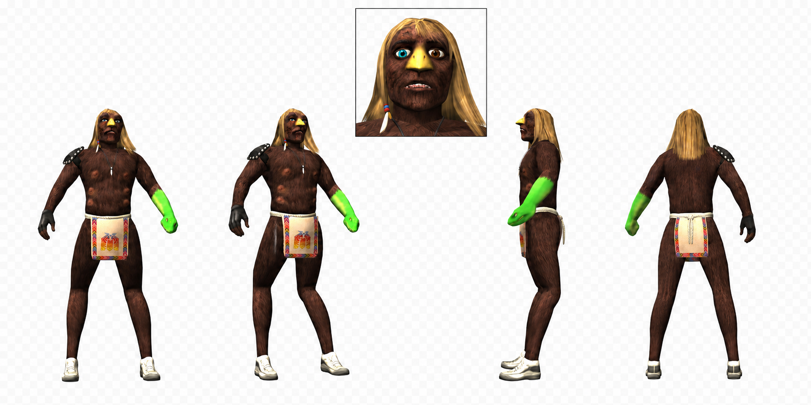

# Xavier Community Engine

An easy creative tool for making original Xavier images, memes, PS2-style scenes, storyboards, fake commercials, and short videos.

You do not need to know prompting.

Tell the Engine what Xavier is doing. It keeps him recognizable, finds the right old-game visual references, creates the first image, keeps scenes consistent, and prepares the animation prompt when you want video.

> **Unofficial community creation tool for original Xavier fan works. Not official show material. Nosimaj Media does not own or claim rights to _Xavier: Renegade Angel_ or the original series.**

## What you need

- **A paid ChatGPT plan with Skills available.** Managed workspaces may require admin approval.
- **ChatGPT image generation** for images and storyboards.
- **A separate video tool** if you want animation. The Engine prepares the prompt, but tools such as Seedance, Kling, or Sora are separate products.

## Install in ChatGPT

1. Download [xavier-community-engine-v1.0.0.zip](https://github.com/nosimajtechnology/xavier-community-engine/releases/latest/download/xavier-community-engine-v1.0.0.zip). **Do not unzip it.**
2. In ChatGPT, open **Plugins** → **Skills** → **Create** → **Upload from your computer**.
3. Select the ZIP and start a new chat.

Start with:

```text
@Xavier Community Engine
```

Then describe a simple idea:

```text
Xavier sees a man arguing with his reflection and tries to separate them.
```

If the first image looks right, reply `Approved.` If one detail is wrong, name only that problem:

```text
The snake arm is on the wrong side. Fix only that.
```

## What you can make

- **STILL** — one finished image
- **MEME** — a quick visual joke or reaction image
- **MINI** — one short animated moment
- **SCENE** — a connected 8–15 second story
- **BUMPER** — a strange ident, loop, or found clip
- **FAKE AD** — a fictional commercial or public-service message
- **EPISODE** — a story built across several connected storyboards
- **REPAIR** — fix only what drifted

Name a mode or just describe your idea and let the Engine choose.

## Canonical Xavier reference

This is the Engine's visual authority for Xavier. It keeps his face, eye colors, snake arm, hair, body, clothing, accessories, and deliberately crude 3D construction consistent.



Scenes, poses, expressions, props, and settings may change. The Engine should not smooth Xavier into polished modern CGI or redesign him as a different fantasy character.

## Supplemental leg authority

Xavier's legs use one thigh, one true knee hinging backward, one lower leg, one ankle, and one normal flat sneaker. This second reference enlarges the approved strict side-profile construction without changing the canonical sheet.


The Engine uses this asset only for lower-body topology. It rejects standard forward human knees, animal hocks, extra segments, and exaggerated curved legs before expanding a scene.

## Need an idea?

- Xavier tries to free a man from his own shadow.
- Xavier adopts a pothole because he thinks it was abandoned.
- Xavier enters a town where questions are illegal and asks why.
- Xavier tries to help a lost tourist by moving the road.
- Xavier finds a scarecrow that wants to quit its job.

More simple starters are available in [EXAMPLE_IDEAS.md](EXAMPLE_IDEAS.md).

## Community use

Community creations are unofficial by default. The Engine does not make new work official show canon.

Suggested credit:

> Unofficial Xavier fan work created with the Xavier Community Engine by Nosimaj Media.

_Xavier: Renegade Angel_ and related character names, designs, imagery, footage, audio, trademarks, and original material belong to their respective rights holders. This project is not affiliated with, sponsored by, or endorsed by Adult Swim, Cartoon Network, Williams Street, Warner Bros. Discovery, PFFR, or other applicable rights holders.

Do not upload or redistribute full episodes, ripped dialogue, show music, scripts, or artwork you do not have permission to use. This tool does not provide financial advice, price targets, or return promises.

Learn more about [Nosimaj Media](https://nosimaj.com).
